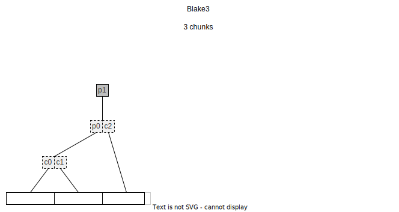
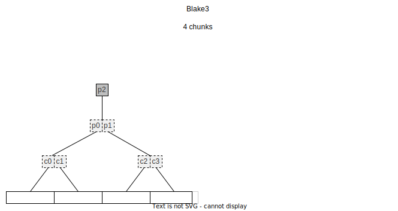
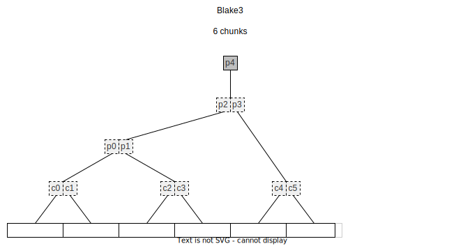
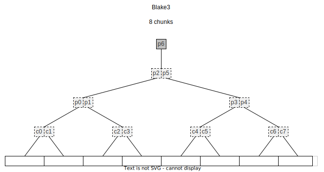
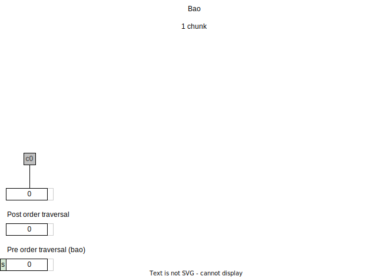
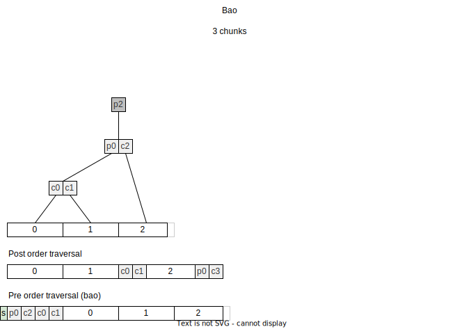
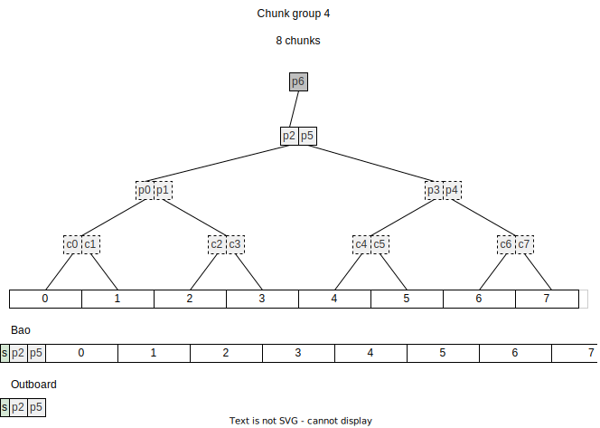
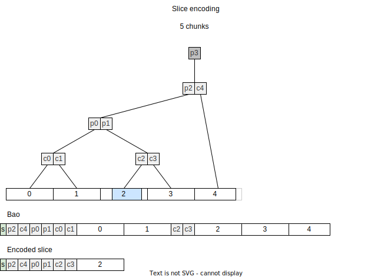
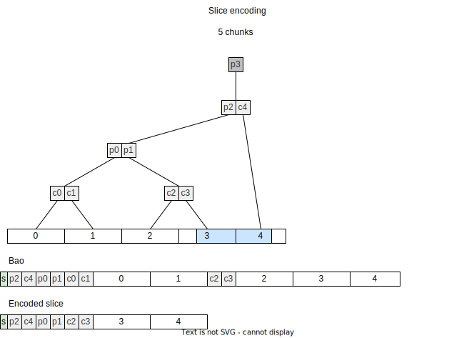

# What is blake3

- [Cryptographic hash function]
- Evolution of the Blake2 family
- One hash function, not a family
- [XOF], [KDF], [PRF] and [MAC]
- Parallelism ([SIMD] and multithreading)

# How does it work

##

##

##

##

##

##

##

##

##

##

##

##

##

##

##

##

##

##

##

##

##

##

## Chunks

- Compute hash of chunk of up to 1024 bytes
- Use of SIMD instructions
- https://github.com/BLAKE3-team/BLAKE3/tree/master/src

## Larger files

- binary tree to combine chunk hashes
- lopsided
- root gets special treatment
- multithreading
- in blake3, binary tree is ephemeral

# Bao

- Persist branch hashes of binary tree
- Verified streaming of entire data
- Verified streaming of ranges
- Outboard and inline mode

# Data encoding

- as you write it - post order
- as you need it when encoding - pre order
- finish / flip from post to pre order

# Inline encoding

- 8 byte header, total size, le
- 64 byte tree nodes, 2 hashes
- 1024 byte data blocks, come in pairs
  (last block can be <1024)

# Outboard encoding

- 8 byte header, total size, le
- 64 byte tree nodes, 2 hashes

# Links

[Blake3 spec]: https://github.com/BLAKE3-team/BLAKE3-specs/blob/master/blake3.pdf
[XOF]: https://en.wikipedia.org/wiki/Category:Extendable-output_functions
[KDF]: https://en.wikipedia.org/wiki/Key_derivation_function
[PRF]: https://en.wikipedia.org/wiki/Pseudorandom_function_family
[MAC]: https://en.wikipedia.org/wiki/HMAC
[SIMD]: https://en.wikipedia.org/wiki/Single_instruction,_multiple_data
[Cryptographic hash function] https://en.wikipedia.org/wiki/Cryptographic_hash_function
[Too much crypto]: https://eprint.iacr.org/2019/1492.pdf

https://en.wikipedia.org/wiki/BLAKE_(hash_function)
https://github.com/BLAKE3-team/BLAKE3/
https://github.com/oconnor663/bao
