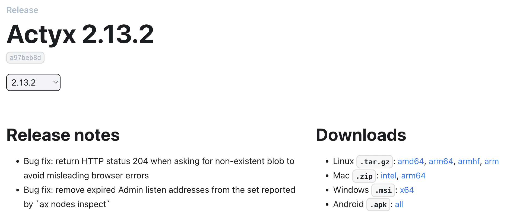

# About me

- [Heavens Above GmbH](https://www.heavens-above.com/)
  - telemetry archive for Columbus module of the ISS
- [Actyx AG](https://www.actyx.com/)
  - distributed event sourcing for factories
- [number zero](n0.computer)
  - iroh, fastest ipfs on any planet
  
# Ipfs-Embed

https://github.com/ipfs-rust/ipfs-embed

- started by David Craven in 2020
- built by David and me for [actyx.com](actyx.com)
- open source (MIT+Apache2)
- *some* kubo interop, but not primary design goal
- intended for small private swarms
- lots of bulletproofing due to prod use

# Features

- low and *bounded* resource usage, in particular memory
- api guided by [local first](https://www.inkandswitch.com/local-first/) principles
  - work from local data when offline
  - never rely on the network being available
  - local data must always be in a consistent state
- soft real time
  - long pauses extremely rare, no safety critical usage
- api might not be appropriate for a cloud ipfs

# Platforms

[](https://developer.actyx.com/releases/actyx/2.13.2)

# API

- internals are out of scope for this talk
- built on rust-libp2p and sqlite
- focus on the API

# local io

- strictly separated from network io
- blocking 👻
- async is not without perf and mental overhead
- sync simplifies writing complex rust code on top
  - see my banyan talk in the ipfs 201 session
- accessing local data should be consistently fast
- my opinion: only sane thing to do on embedded
- might be different for a cloud deployment

## Local IO api

```rust
// Returns a block from the block store.
pub fn get(&self, cid: &Cid) -> Result<Block>

// Inserts a block in to the block store.
// Note: will not automatically publish on the DHT
pub fn insert(&self, block: Block) -> Result<()>

// Checks if the block is in the block store.
pub fn contains(&self, cid: &Cid) -> Result<bool>

/// Returns an Iterator of Cids for all blocks stored in the block store.
pub fn iter(&self) -> Result<impl Iterator<Item = Cid>>;
```

## Mental cost of async

```rust
    fn add_stream<'life0, 'life1, 'async_trait>(
        &'life0 self,
        path: &'life1 Path,
        wrap: bool
    ) -> Pin<Box<dyn Future<Output = Result<LocalBoxStream<'static, Result<AddEvent>>>> + 'async_trait>>
    where
        'life0: 'async_trait,
        'life1: 'async_trait,
        Self: 'async_trait,
    { ... }
```

## Perf cost of async

- Looks innocent enough
  ```rust
#[async_trait]
pub trait IpfsFetchApi {
    async fn fetch(&self, cid: &Cid) -> Result<Option<Bytes>>;
```
- But allocates even for getting a 1 byte block
  ```rust
trait IpfsFetchApi {
    fn fetch(&self, cid: &Cid)
      -> Pin<Box<dyn Future<Output = Result<Bytes>>>>
```
- in async rust, abstraction is no longer without cost

## But surely not *everything* can be sync?

- I think [sled](https://crates.io/crates/sled) hits a sweet spot
- Cheap local interactions are sync
- Flush is async
- Ipfs-Embed follows this
  - `sync`, `fetch`, `flush` are async

- [@spacejam on rust async for sled](https://github.com/spacejam/sled/issues/1123)
- [@tomaka on rust async](https://tomaka.medium.com/a-look-back-at-asynchronous-rust-d54d63934a1c)
  <^ **THIS!**

# Pinning

- pinning is independent of block availability
- you can pin things you don't have
  - pin the root of wikipedia before looking at it
  - while you browse it everything will be kept
- all pins are recursive
  - we did not find this a big limitation
  - you can still have a link to something big

# Temp pins

- used during DAG construction and DAG update
- cheap
- use [RAII](https://en.wikipedia.org/wiki/Resource_acquisition_is_initialization)
- basically just "gc, leave me alone while I build this"
- ephemeral. On restart they are gone
- easy to implement with an embedded in-process ipfs
<!--- lifetime of ipfs is the same as lifetime of the app -->

## API

```rust
// Creates a temporary pin in the block store. A temporary pin is not persisted to disk and is released once it is dropped.
pub fn create_temp_pin(&self) -> Result<TempPin>

// Adds a new root to a temporary pin.
pub fn temp_pin(&self, tmp: &mut TempPin, cid: &Cid) -> Result<()>
```

# Named pins / aliases

- usually just a few
- common to have one per app
- name is a blob
  - Not a big fan of restricting to utf8
- persistent

## API

```rust
pub fn alias<T: AsRef<[u8]> + Send + Sync>(
    &self,
    alias: T,
    cid: Option<&Cid>
) -> Result<()>
```

# Network

- `fetch`, like get but gets also from network
- `sync`, syncs an entire DAG
  - returns a stream of progress updates
- gossipsub `publish`/`subscribe`
- `broadcast` to all connected peers

## Blocks API

```rust
// Either returns a block if it’s in the block store or tries to retrieve it from a peer.
pub async fn fetch(&self, cid: &Cid, providers: Vec<PeerId>) -> Result<Block<P>>

// sync an entire DAG, returning an update stream
pub fn sync(&self, cid: &Cid, providers: Vec<PeerId>) -> SyncQuery<P>
```

## Messaging API

```rust
    /// Subscribes to a topic returning a Stream of messages.
    pub fn subscribe(&mut self, topic: String) -> impl Future<Output = Result<impl Stream<Item = GossipEvent>>>;

    /// Publishes a new message in a `topic`, sending the message to all subscribed peers.
    pub fn publish(&mut self, topic: String, msg: Vec<u8>) -> impl Future<Output = Result<()>>;

    /// Publishes a new message in a `topic`, sending the message to all subscribed connected peers.
    pub fn broadcast(&mut self, topic: String, msg: Vec<u8>) -> impl Future<Output = Result<()>>;
```

# Store

- based on [sqlite](https://www.sqlite.org/index.html)
- was going to use [sled](https://crates.io/crates/sled), but @spacejam advised against it
  - "if reliability is your primary constraint, use SQLite. sled is beta."

## Future store?

- working on my own custom db [radixdb](https://crates.io/crates/radixdb)
  - radix tree with pluggable storage backend
  - marble by @spacejam as possible storage backend
  - WASM compatible low perf but simple storage backends

# GC

- Uses recursive sqlite query to figure out what to keep
- `WITH_RECURSIVE` FTW
<!---
  not that fast, but rocks solid and quick to implement bc sqlite
  would do in memory graph later
-->
- Then drops the actual orphaned blocks
- Done incrementally to limit gc pauses

## SQL

```sql
WITH RECURSIVE
    descendant_of(id) AS
    (
        SELECT block_id FROM aliases UNION SELECT block_id FROM temp_pins
        UNION
        SELECT child_id FROM refs, descendant_of ON id = parent_id
    )
SELECT id FROM cids
WHERE id NOT IN descendant_of;
```

## Tradeoffs

- very slow compared to in mem graph travesal
- was fast to implement and bulletproof because of SQLite ACID guarantees

# GC time limits

- Set a target gc time
- To ensure progress, set min amount to be GCed
- Config
  ```rust
pub struct StorageConfig {
    pub gc_interval: Duration,
    pub gc_target_duration: Duration,
    pub gc_min_blocks: usize,
}
```

# Store size limits

- limits for size *and* number of blocks
  - reason: lots of small blocks cause large overhead
- limits do not apply to pinned data
- config
  ```rust
pub struct StorageConfig {
    pub cache_size_blocks: u64,
    pub cache_size_bytes: u64,
}
```

# Caching

- Customizable caching strategy
- in memory LRU
- persistent LRU in separate db
  - access db can be fast non-ACID db
- heurisics to keep certain blocks, e.g. unixfs directories

## Caching trait

```rust
pub trait CacheTracker {
    fn has_persistent_state(&self) -> bool;

    fn blocks_accessed(&self, blocks: Vec<BlockInfo>) { ... }
    fn blocks_written(&self, blocks: Vec<WriteInfo>) { ... }
    fn blocks_deleted(&self, blocks: Vec<BlockInfo>) { ... }
    fn sort_ids(&self, ids: &mut [i64]) { ... }
    fn retain_ids(&self, ids: &[i64]) { ... }
}
```

# Sync example

```rust
    let mut tmp = ipfs.create_temp_pin()?;
    ipfs.temp_pin(&mut tmp, cid);
    ipfs.sync(cid, peers).await?;
    ipfs.alias(DAG_ROOT, Some(cid))?;
    drop(tmp);
```

# Build example

```rust
    let mut tmp = ipfs.create_temp_pin()?;
    while let Some(block) = builder.next() {
        ipfs.temp_pin(&mut tmp, block.cid())?;
        let _ = a.insert(block)?;
    }
    a.alias(DAG_ROOT, builder.prev.as_ref())?;
    drop(tmp);
```

# Peers

- can't afford to have 600 peers on embed hw
- so choosing which peers to keep becomes important
- prioritize peers based on source
- bootstrap peers forever
- manually connected for longer than mdns
- mdns (probably local) longer than other

# API Questions

- should temp pins be `Send` + `Sync` + `Clone`
- best way to notify api user of progress
  - currently struct that implements `Stream` and `Future`.
- should subscribe be for pubsub and broadcast, or separate?
- biggest: incomplete sync of graphs
  - just limit depth?
  - graphsync.rs?
  - send predicate over?
  # Audience Questions
