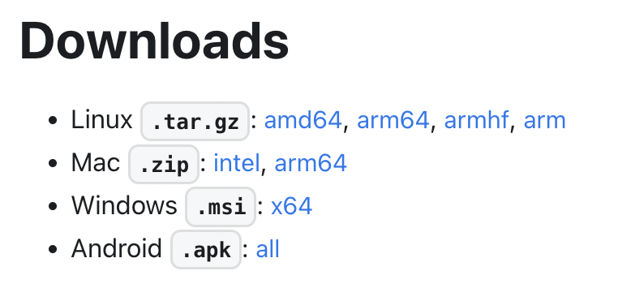

# Ipfs-Embed

https://github.com/ipfs-rust/ipfs-embed

- built by and for actyx.com
- open source (MIT+Apache2)
- *some* kubo interop, but not primary design goal
- for small swarms
- lots of bulletproofing due to prod use

# Ipfs-Embed features

- low and *bounded* resource usage, in particular memory
- api guided by [local first](https://www.inkandswitch.com/local-first/) principles
  - work from local data when offline
  - never rely on the network being available
  - local data must always be in a consistent state
- soft real time
  - long pauses extremely rare, but not safety critical
- might not be appropriate for a cloud ipfs

---

<!--- mic drop moment -->


# API

- internals are out of scope for this talk
- built on rust-libp2p and sqlite
- focus on the API

# blocking local io

- my opinion: only sane thing to do on embedded
- async is not without (mental and performance) overhead
- simplifies writing complex rust code on top
  - see my banyan talk in the ipfs 201 session
- accessing local data should be memory mapped IO anyway
- this will be different for a cloud deployment

##

```rust
// Returns a block from the block store.
pub fn get(&self, cid: &Cid) -> Result<Block<P>>

// Inserts a block in to the block store.
pub fn insert(&self, block: Block<P>) -> Result<()>

// Checks if the block is in the block store.
pub fn contains(&self, cid: &Cid) -> Result<bool>
```

##

```rust

```

# Pinning

- pinning has *nothing* to do with the actual data
- you can pin things you don't have
  - pin the root of wikipedia before looking at it
  - while you browse it everything will be kept
- all pins are recursive
  - we did not find this a big limitation
  - you can still have a link to something big

# Temp pins

- used during DAG construction and DAG update
- cheap
- use [RAII](https://en.wikipedia.org/wiki/Resource_acquisition_is_initialization)
- basically just "gc, leave me alone while I build this"
- ephemeral. On restart they are gone
- easy to implement with an embedded in-process ipfs

## API

```rust
// Creates a temporary pin in the block store. A temporary pin is not persisted to disk and is released once it is dropped.
pub fn create_temp_pin(&self) -> Result<TempPin>

// Adds a new root to a temporary pin.
pub fn temp_pin(&self, tmp: &mut TempPin, cid: &Cid) -> Result<()>
```

## Usage example

```rust
```

## Dags are always built from the leaves up

<picture of dag building>

# Named pins / aliases

- usually just a few
- common to have one per app
- name is a blob
  - Not a big fan of restricting to utf8
- persistent

## API

```rust
pub fn alias<T: AsRef<[u8]> + Send + Sync>(
    &self,
    alias: T,
    cid: Option<&Cid>
) -> Result<()>
```

# Network

- fetch, like get but gets also from network
- sync, syncs an entire DAG
  - returns a stream of progress updates

## API

```rust
// Either returns a block if it’s in the block store or tries to retrieve it from a peer.
pub async fn fetch(&self, cid: &Cid, providers: Vec<PeerId>) -> Result<Block<P>>

// sync an entire DAG, returning an update stream
pub fn sync(&self, cid: &Cid, providers: Vec<PeerId>) -> SyncQuery<P>
```

## Sync code example

```rust
```

## Fetch code example

```rust
```

# Store

- based on [sqlite](https://www.sqlite.org/index.html)
- was going to use [sled](https://crates.io/crates/sled), but author advised against it
  - "if reliability is your primary constraint, use SQLite. sled is beta."
- working on my own custom db [radixdb](https://crates.io/crates/radixdb)

# GC

- Uses sqlite query to figure out what to keep
- `WITH_RECURSIVE` FTW
<!---
  not that fast, but rocks solid and quick to implement bc sqlite
  would do in memory graph later
-->
- Then drops the actual orphaned blocks
- Done incrementally to limit gc pauses

## SQL

```sql
WITH RECURSIVE
    descendant_of(id) AS
    (
        SELECT block_id FROM aliases UNION SELECT block_id FROM temp_pins
        UNION
        SELECT child_id FROM refs, descendant_of ON id = parent_id
    )
SELECT id FROM cids
WHERE id NOT IN descendant_of;
```

## Tradeoffs

- very slow compared to in mem graph travesal
- was fast to implement and bulletproof because of SQLite ACID guarantees

# GC time limits

- Set a target gc time
- To ensure progress, set min amount to be GCed
- Config
  ```rust
pub struct StorageConfig {
    pub gc_interval: Duration,
    pub gc_target_duration: Duration,
    pub gc_min_blocks: usize,
}
```

# Store size limits

- limits for size *and* number of blocks
  - reason: lots of small blocks cause large overhead
- limits do not apply to pinned data
- config
  ```rust
pub struct StorageConfig {
    pub cache_size_blocks: u64,
    pub cache_size_bytes: u64,
}
```

# Caching

- Customizable caching strategy
- in memory LRU
- persistent LRU in separate db
  - access db can be non-ACID db
- prefer to keep certain blocks, e.g. unixfs directories

## Caching trait

```rust
pub trait CacheTracker {
    fn has_persistent_state(&self) -> bool;

    fn blocks_accessed(&self, blocks: Vec<BlockInfo>) { ... }
    fn blocks_written(&self, blocks: Vec<WriteInfo>) { ... }
    fn blocks_deleted(&self, blocks: Vec<BlockInfo>) { ... }
    fn sort_ids(&self, ids: &mut [i64]) { ... }
    fn retain_ids(&self, ids: &[i64]) { ... }
}
```

# Peers

- prioritize peers based on source
- e.g.
  - bootstrap forever
  - manually connected for longer than mdns
  - ...